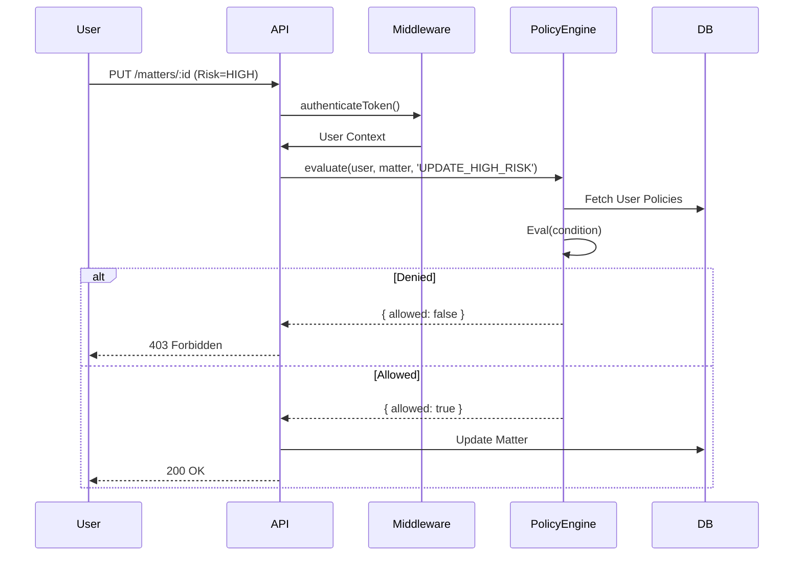

# System Architecture

## Overview
NomosDesk is a Legal Operations Platform designed for **Data Sovereignty** and **AI Governance**. It employs a Hexagonal Architecture (Ports & Adapters) to isolate core logic from external providers.

## Core Components

### 1. Verification & Security Layer
- **RBAC Middleware**: `verifyRole` checks static permissions.
- **Policy Engine**: `PolicyEngine.evaluate` enforces dynamic ABAC rules.
- **AI Guard**: Intercepts AI requests (`/api/chat`) to enforce "Human-in-the-Loop" for low-confidence or high-stakes actions.

### 2. Identity & Access
- **OIDC Service**: Handles Federated Identity (Azure AD, Okta).
- **Audit Service**: Logs all sensitive actions with tamper-evident hashing.

### 3. Integration Adapters
- **Storage Port**: Abstracts file storage (Blob vs Local NAS).
- **Identity Port**: Abstracts Auth providers.

## Data Flow: "High Risk Matter Update"

